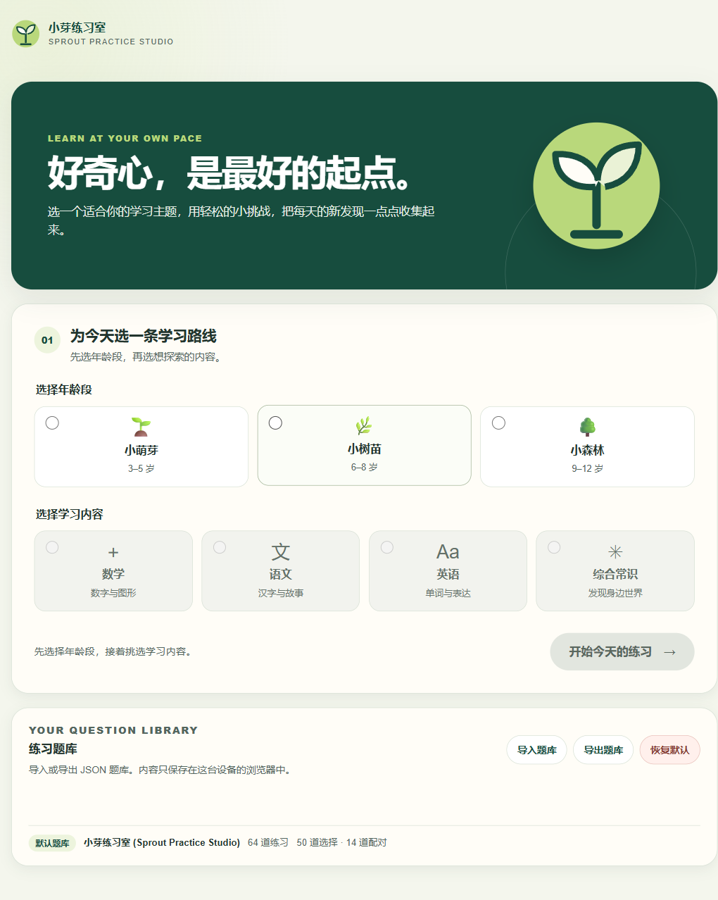
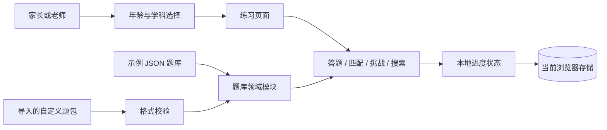

# 小芽练习室 · Sprout Practice Studio

[](https://github.com/2370495869/sprout-practice-studio/actions/workflows/ci.yml)
[](LICENSE)
[](https://nodejs.org/)

**小芽练习室**是一个面向 3–12 岁儿童、由家长或老师陪伴使用的轻量学习练习工具。孩子可以按年龄段和学科开始短练习；分数和自定义题包保存在当前浏览器，不需要账号或应用后端。

> 当前题库中的 64 道题是演示样例，尚未经过课程专家或学校审核。请家长、老师在教学使用前自行检查内容和难度。

**在线演示：** [GitHub Pages](https://2370495869.github.io/sprout-practice-studio/)。

**源码仓库：** [2370495869/sprout-practice-studio](https://github.com/2370495869/sprout-practice-studio)。

## 首页截图



## 功能

- 按 3–5、6–8、9–12 岁年龄段，以及数学、语文、英语、综合常识选择练习。
- 提供选择题、配对练习、限时挑战和题目搜索四种活动方式；配对题支持点击与键盘操作。
- 支持从题库 JSON 开始练习，并在浏览器本地导入、导出自定义题包。
- 在当前浏览器中保存分数、挑战纪录和自定义题包；应用不会上传或同步这些练习数据。
- 以静态网站形式运行，可本地启动，也可部署到 GitHub Pages 或其他静态托管服务。

自定义题包会经过格式检查；导入前仍应由成年人检查题目答案、解释和适龄程度。题包格式见[题目格式说明](docs/question-format.md)。

## 技术结构

项目使用 Vite 构建两个 HTML 入口，页面交互由原生 JavaScript ES modules 实现。题库领域模块负责加载、筛选和校验题目；浏览器存储模块负责本地进度和自定义题包；页面模块把这些能力组合为练习流程。静态构建并不包含 Service Worker 或离线缓存。



更多设计边界见[架构说明](docs/architecture.md)和[设计决策](docs/design-decisions.md)。

## 本地运行

需要 Node.js 22.12.0 或更高版本及 npm。CI 固定使用 Node.js 24。

```sh
git clone https://github.com/2370495869/sprout-practice-studio.git
cd sprout-practice-studio
npm ci
npm run dev
```

开发服务器会打印本地地址。首次访问后选择年龄段、学科和练习方式。常用质量检查与构建命令：

```sh
npm run lint
npm run format:check
npm test
npm run test:coverage
npm run build
```

完整开发、手动检查和贡献步骤见[开发指南](docs/development.md)。

## 数据与隐私

- 项目没有账号或应用后端；应用代码不会上传或同步分数、挑战纪录和自定义题包。
- 年龄段和学科用于练习选择；分数、挑战纪录和自定义题包留在当前浏览器的本地存储中。
- 作为托管网页，浏览器仍会从静态托管服务请求页面资源；托管服务可能按其隐私政策记录访问请求。应用本身不连接学习数据 API，也不提供云端同步。
- 本地数据按浏览器和站点来源隔离，不会自动同步到其他设备。清理浏览器站点数据会删除这些记录；自定义题包可先导出备份。
- 题目示例随项目代码提供。使用自定义题包时，不要录入儿童姓名、联系方式、学校信息或其他可识别个人身份的数据。

## 质量与发布

GitHub Actions 在 Node.js 24 上运行 lint、格式检查、Node 内置测试和 Vite 构建。Pages 工作流仅为 `main` 分支构建和部署；发布 `v*` 标签时，release 工作流构建并附加静态站点 ZIP。配置不代表这些工作流已经成功运行。

Node 内置测试还提供仅覆盖确定性领域模块的覆盖率报告；该报告不代表浏览器 UI、可访问性或完整应用的测试覆盖率。

Pages 构建会把仓库名写入 Vite 的 `VITE_BASE_PATH`，让项目站点能在 `/<repository>/` 子路径加载静态资源。相关流程见[架构说明](docs/architecture.md)。

## 路线图

- 完善题库导入失败恢复、本地数据兼容和纯领域逻辑测试。
- 继续改进小屏幕、键盘操作、触摸交互和屏幕阅读器体验。
- 建立题目内容审阅清单，逐步替换未经验证的示例内容。
- 评估 Service Worker 离线缓存，并明确更新和缓存失效策略后再实现。
- 在部署成功并完成页面检查后，再补充真实线上演示地址和截图。

路线图不代表功能已经实现。当前实现范围与取舍见[设计决策](docs/design-decisions.md)。

## 贡献与许可

欢迎提交缺陷、改进建议和经过核对的题目修订。请先阅读[开发指南](docs/development.md)、[题目格式说明](docs/question-format.md)和[设计决策](docs/design-decisions.md)。

本项目按 [MIT License](LICENSE) 发布。求职简历表达与面试准备材料见[简历说明](docs/resume-notes.md)。
