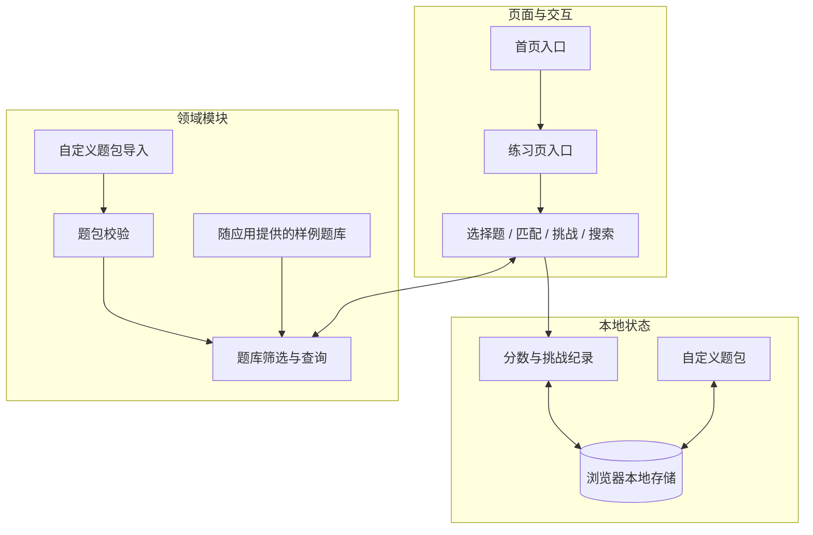

# 架构说明

本文描述小芽练习室（Sprout Practice Studio）的目标工程结构，以及静态浏览器应用当前适合承担的边界。项目不依赖应用服务端 API；构建产物由静态 Web 主机提供。

## 运行时分层

| 层            | 职责                                       | 边界                                       |
| ------------- | ------------------------------------------ | ------------------------------------------ |
| Vite 多页入口 | 构建 `index.html` 与 `learn.html` 两个页面 | 开发服务器和生产构建；不承担学习规则       |
| 页面模块      | 选择年龄段/学科，切换练习模式，呈现反馈    | 处理 DOM 和用户事件；不直接定义题库规则    |
| 题库领域模块  | 解析、校验、筛选题目和自定义题包           | 纯数据逻辑，避免依赖 DOM 与浏览器存储      |
| 本地状态模块  | 读写分数、挑战纪录和自定义题包             | 通过浏览器本地存储实现；不上传或跨设备同步 |
| 示例内容      | 提供随应用打包的 JSON 题目                 | 作为演示数据，不宣称经过课程标准或专家验证 |

## 内容流

1. 用户选择年龄段和学科，进入对应练习页面。
2. 页面向题库模块请求匹配的题目；题库模块将示例内容和已导入的自定义题包作为数据源。
3. 导入流程先校验 JSON 结构、题型字段和答案映射，再将可用题包写入本地状态。
4. 活动模块反馈作答结果，并将进度交给本地状态模块保存。
5. 导出流程把自定义题包序列化为 JSON 文件，由用户选择存放位置。

## 静态部署

生产构建由 Vite 生成静态文件。根路径由 `VITE_BASE_PATH` 控制：本地和可部署到域名根目录的场景使用 `/`；GitHub Pages 项目站点使用 `/${repository}/`。Pages 工作流从 GitHub 事件中的仓库名设置该变量，只在 `main` 分支部署。Release 工作流以 `./` 构建静态 ZIP，便于解压到相对路径托管环境。

GitHub Actions 负责检查和打包，不提供数据库、用户账户或远程题库。网页资源由静态主机提供，浏览器需要联网请求这些资源；当前没有 Service Worker 或离线缓存。Pages 和 Release 工作流文件已配置，但运行结果和公开 URL 需要实际部署后再验证。

## 测试边界

Node 内置 `node:test` 用于测试不依赖 DOM 的规则，例如年龄/学科筛选、题型校验、答案映射和存储序列化。覆盖率报告只针对确定性领域模块；浏览器交互、触屏体验与 Pages 子路径需要另行手动检查，不能把该报告当作完整应用或 UI 的覆盖率。

CI 通过 `npm ci` 安装 lockfile 中的依赖，然后运行 lint、格式检查、自动化测试和生产构建。CI 成功状态以 GitHub Actions 的实际运行记录为准。
